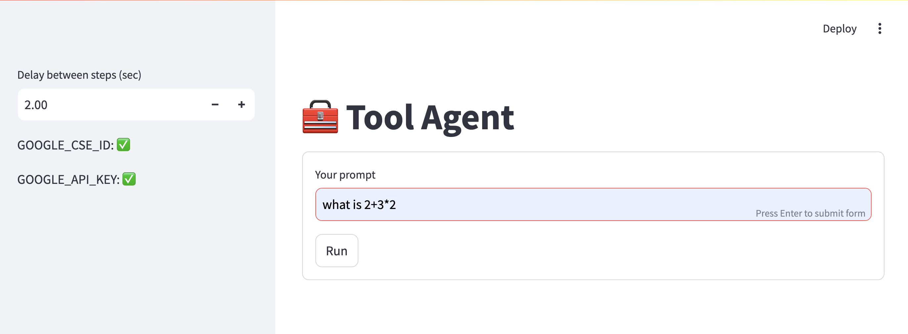
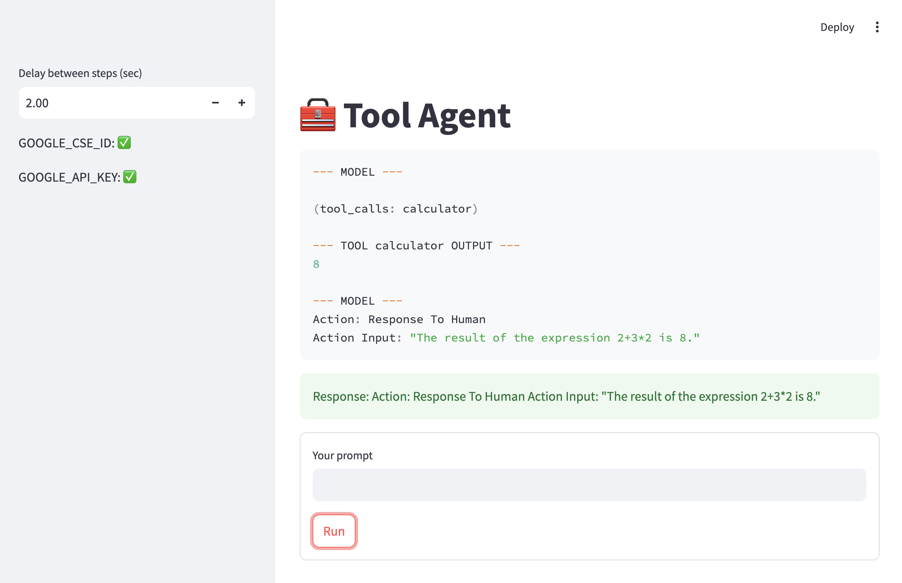
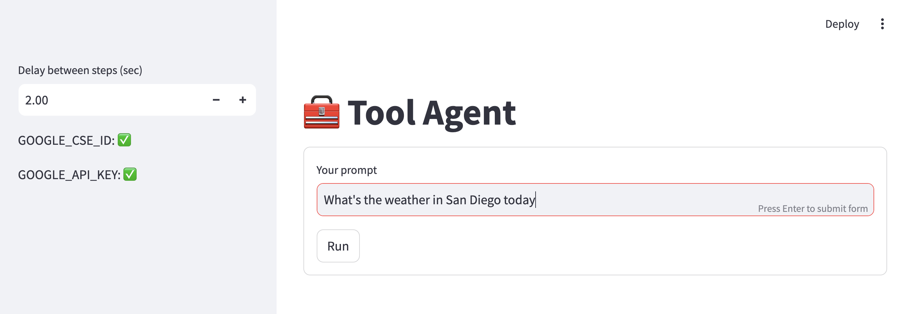
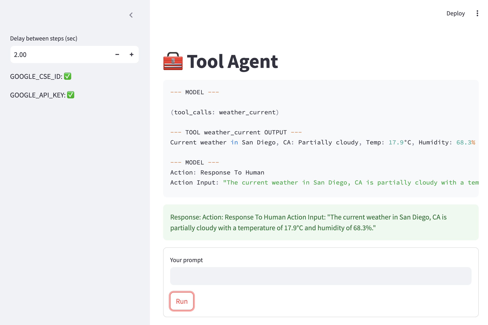

# 🧰 LLM_Agent


A lightweight AI tool-using agent built with **Streamlit**, **OpenAI function calling**, and external APIs. The app can decide when to use tools for **web search**, **math**, and **current weather**, then return a final answer in a simple interactive UI.

## Screenshots

### Home


### Calculator tool call


### Weather query


### Weather tool call


## Features

- OpenAI-powered agent loop
- Function-calling tools
- Google Custom Search integration
- Calculator tool for expressions
- Current weather lookup with Visual Crossing
- Streamlit interface with step delay control
- Tool execution logs shown in the UI

## Repo Structure

```text
LLM_Agent/
├── agent.py                # Main Streamlit app and agent loop
├── requirements.txt        # Python dependencies
├── .env.example            # Example environment variables
├── .gitignore              # Ignore secrets and local files
├── README.md               # Project documentation
└── screenshots/
    ├── home.png
    ├── calculator-demo.png
    ├── weather-input.png
    └── weather-demo.png
```

## Quick Start

### 1) Clone the repo

```bash
git clone https://github.com/your-username/LLM_Agent.git
cd LLM_Agent
```

### 2) Install dependencies

```bash
pip install -r requirements.txt
```

### 3) Create a `.env` file

```env
OPENAI_API_KEY=your_openai_api_key
GOOGLE_API_KEY=your_google_api_key
GOOGLE_CSE_ID=your_google_cse_id
VISUALCROSSING_API_KEY=your_visualcrossing_api_key
```

### 4) Run the app

```bash
streamlit run agent.py
```

## Example Prompts

- `what is 2+3*2`
- `What's the weather in San Diego today?`
- `latest news about AI startups`

## Tech Stack

- Python
- Streamlit
- OpenAI API
- Google Custom Search API
- Visual Crossing Weather API
- py-expression

## Notes

This app currently expects environment variables for all enabled tools. A good next improvement is to make missing tools fail gracefully instead of stopping the app.

## Suggested `.gitignore`

```gitignore
.env
.venv/
__pycache__/
*.pyc
.DS_Store
.streamlit/secrets.toml
```

## Suggested `.env.example`

```env
OPENAI_API_KEY=
GOOGLE_API_KEY=
GOOGLE_CSE_ID=
VISUALCROSSING_API_KEY=
```

## License

You can use MIT if you want this repo to be easy to share and reuse.
